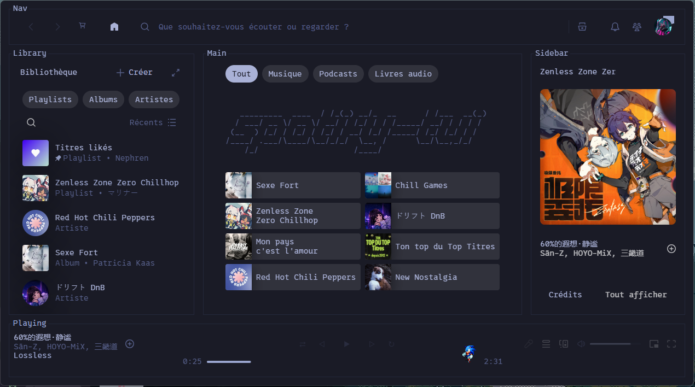
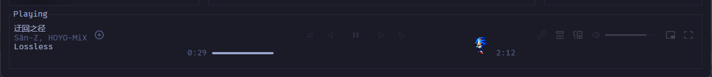

# Spicetify-tui

A Spicetify theme inspired by [spotify-tui](https://github.com/Rigellute/spotify-tui), styled after a terminal interface: panel border labels ("Nav", "Library", "Main", "Sidebar", "Playing"), Nerd Font monospace typography, an ASCII art banner on the home page, and text-glyph playback controls instead of SVG icons.

Originally based on the community [`text`](https://github.com/spicetify/spicetify-themes/tree/main/text) theme from the official `spicetify-themes` repo, heavily reworked since (progress bar, volume bar, layout, and compatibility fixes for recent Spotify updates).

*(Lisez ceci en [français](README_FRENCH.md))*

## Preview




## Requirements

- [Spicetify](https://spicetify.app/) installed and working
- The **[0xProto Nerd Font Mono](https://github.com/ryanoasis/nerd-fonts/releases/latest/download/0xProto.zip)** font installed on your system — required for the ASCII banner alignment and the control glyphs

## Installation

1. Download `user.css` and `color.ini` from this repo.
2. Create a `TUI` folder in your Spicetify Themes directory:
   - Windows: `%appdata%\spicetify\Themes\TUI\`
   - Linux/macOS: `~/.config/spicetify/Themes/TUI/`
3. Place both files inside it.
4. In a terminal:
   ```
   spicetify config current_theme TUI
   spicetify config color_scheme TokyoNight
   spicetify config inject_css 1 replace_colors 1 overwrite_assets 1
   spicetify apply
   ```
5. Install the 0xProto Nerd Font Mono font (link above) if you haven't already, then run `spicetify apply` again.

## Available palettes

The `color.ini` file includes several palettes (TokyoNight, TokyoNightStorm, Catppuccin, Dracula, Gruvbox, Nord, Rosé Pine, Solarized, Everforest, and more). Switch palettes with:
```
spicetify config color_scheme <PaletteName>
spicetify apply
```

## Credits

- Base `text` theme: [spicetify/spicetify-themes](https://github.com/spicetify/spicetify-themes)
- Inspiration: [Rigellute/spotify-tui](https://github.com/Rigellute/spotify-tui)
- "Sonic Dancing" snippet (optional, install separately via Marketplace): [@uhAlexz](https://github.com/uhAlexz), via [spicetify/marketplace](https://github.com/spicetify/marketplace)

## License

Add the license of your choice here (e.g. MIT) — note that the base theme itself is licensed, so check the `spicetify-themes` repo's license before publishing.
