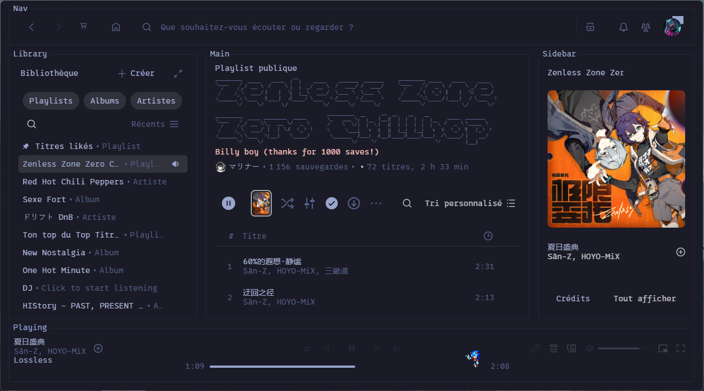

# Spicetify-tui

Un thème Spicetify inspiré de [spotify-tui](https://github.com/Rigellute/spotify-tui), façon interface terminal : bordures, labels de panneaux ("Nav", "Library", "Main", "Sidebar", "Playing"), police monospace Nerd Font, bannière ASCII sur l'accueil, contrôles de lecture en glyphes texte.

Basé à l'origine sur le thème communautaire [`text`](https://github.com/spicetify/spicetify-themes/tree/main/text) du dépôt officiel `spicetify-themes`, largement retravaillé (barre de progression, barre de volume, mise en page, correctifs de compatibilité avec les mises à jour récentes de Spotify).

*(Read this in [English](README.md))*

## Aperçu




## Prérequis

- [Spicetify](https://spicetify.app/) installé et fonctionnel
- La police **[0xProto Nerd Font Mono](https://github.com/ryanoasis/nerd-fonts/releases/latest/download/0xProto.zip)** installée sur le système — indispensable à l'alignement de la bannière ASCII et aux glyphes des contrôles

## Installation

1. Télécharge `user.css` et `color.ini` de ce dépôt.
2. Crée un dossier `TUI` dans ton répertoire de thèmes Spicetify :
   - Windows : `%appdata%\spicetify\Themes\TUI\`
   - Linux/macOS : `~/.config/spicetify/Themes/TUI/`
3. Place les deux fichiers dedans.
4. Dans un terminal :
   ```
   spicetify config current_theme TUI
   spicetify config color_scheme TokyoNight
   spicetify config inject_css 1 replace_colors 1 overwrite_assets 1
   spicetify apply
   ```
5. Installe la police 0xProto Nerd Font Mono (lien ci-dessus) si ce n'est pas déjà fait, puis relance `spicetify apply`.

## Palettes disponibles

Le fichier `color.ini` inclut plusieurs palettes (TokyoNight, TokyoNightStorm, Catppuccin, Dracula, Gruvbox, Nord, Rosé Pine, Solarized, Everforest, etc.). Change de palette avec :
```
spicetify config color_scheme <NomDeLaPalette>
spicetify apply
```

## Crédits

- Thème de base `text` : [spicetify/spicetify-themes](https://github.com/spicetify/spicetify-themes)
- Inspiration : [Rigellute/spotify-tui](https://github.com/Rigellute/spotify-tui)
- Snippet "Sonic Dancing" (optionnel, à installer séparément via le Marketplace) : [@uhAlexz](https://github.com/uhAlexz), via [spicetify/marketplace](https://github.com/spicetify/marketplace)

## Licence

[MIT](LICENSE) — même licence que le thème de base `text` de [spicetify/spicetify-themes](https://github.com/spicetify/spicetify-themes), dont ce thème est dérivé.
